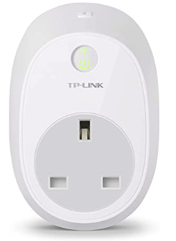
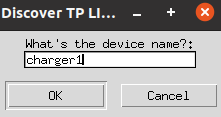
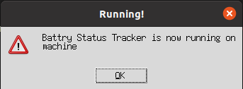

# Python TPLink Smart Battery
Simple software that makes uses of TP Link Kasa smart plugs to control battery charging / discharging cycles.

It works on Ubuntu 20.04 and TPLink HS100, but should also work with HS100, HS103, HS105, HS110 devices.

## How it works
Given a TPLink Kasa Smart plug is installed 
We made use of existing technology on the market and build a Smart Battery Plug software that 
will cut off the power supply to the battery once it is 100% charged and the CPU temperature reaches high levels.

The Plug will turn on again once the battery falls below 20%, this prevents micro charging cycles prolonging the battery life too.

## Run
`python tracker.py`

An input will ask you for the name of your device, in my case I set it up as "charger1", so I enter that an press OK.

If the device is found correctly you should get a confirmation message and the application will keep running.

## Why
When you are working on your laptop you often leave it plug to the battery for several hours.
We all know batteries tend to deteriorate overtime especially if temperature rises too much, and it may lead to a laptop with no battery life left in it, sooner than you expected.

Some specific laptops have this functionality built in already, but may don't so this is a simple and inexpensive fix.

## Improvements
TBC